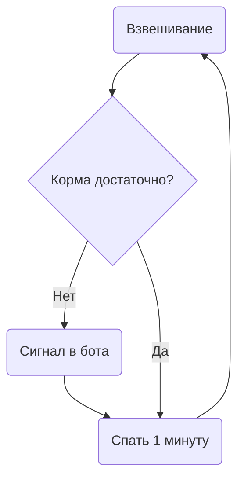
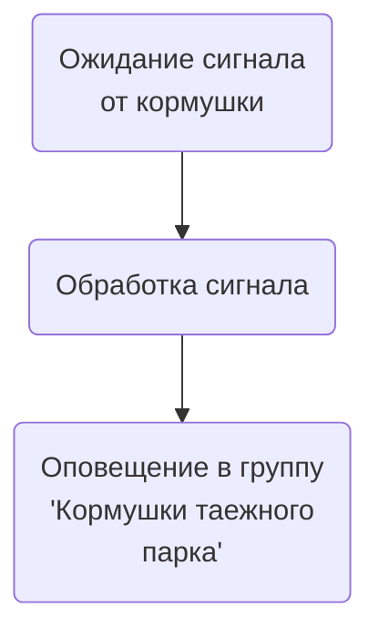

```mermaid
flowchart TD
    A(Взвешивание) --> B{Корма достаточно?}
    B --> |Нет| C(Сигнал в бота)
    C --> D(Спать 1 минуту)
    B --> |Да| D
    D --> A
```

# Бот

```mermaid
flowchart TD
    A(Ожидание сигнала <br> от кормушки) --> B(Обработка сигнала)
    B --> C(Оповещение в группу <br> 'Кормушки таежного <br> парка')

```